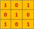
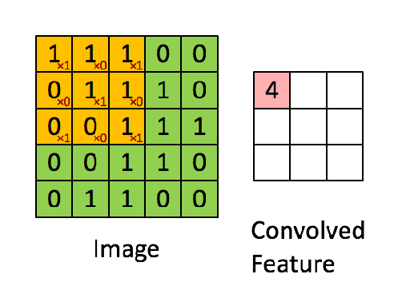
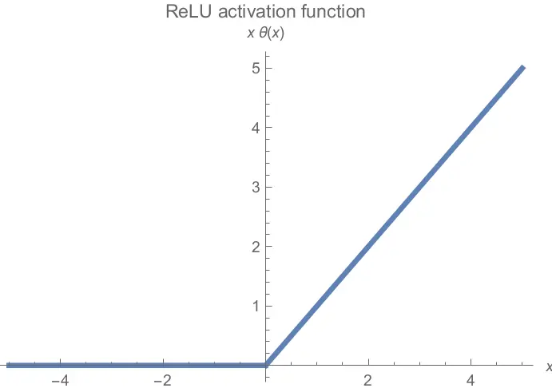
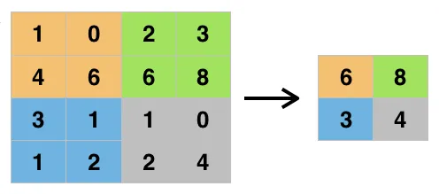

# CNN algoritmalarından UNet mimarisi kullanılarak oluşturulmuş Model ile GPR Verilerinin İşlenmesi
Merhabalar! Bu projemizde, literatürde Ground Penetrating Radar (GPR) olarak bilinen ve dilimize yeraltı radarı şeklinde geçmiş cihazın, yeraltı nesneleri için yaptığı taramalar sonucu elde ettiği verileri işleyerek, yeraltında bulunan cisimlerin tam konum tahminini sonuç olarak çıktı veren bir model üzerine çalışıyoruz.
Anlatımımda kodumuzun ne amaçla yazıldığından daha çok, kod içerisinde kullanılan metodolojiden bahsetmek istiyorum.
## CNN Mimarisi
CNN genellikle görüntü işlemede kullanılan ve girdi olarak görselleri alan bir derin öğrenme algoritmasıdır. Farklı operasyonlarla görsellerdeki featureları (özellikleri) yakalayan ve onları sınıflandıran bu algoritma farklı katmanlardan oluşmaktadır. Convolutional Layer, Pooling ve Fully Connected olan bu katmanlardan geçen görsel, farklı işlemlere tabii tutularak derin öğrenme modeline girecek kıvama gelir.
### Katmanlardan Bahsetmek gerekirse:
#### - Evrişim Katmanı
Convolutional (evrişim katmanı) CNN algoritmalarında görüntüyü ele alan ilk katmandır. Bilindiği üzere görseller aslında içlerinde belirli değerler taşıyan piksellerden oluşan matrislerdir. Evrişim katmanında da orijinal görsel boyutlarından daha küçük bir filtre görselin üzerinde gezer ve bu görsellerden belirli özellikleri yakalamaya çalışır. Böylelikle görüntümüzün özellik haritasını çıkarmaya başlamış oluruz.

Görüntü üzerinde gezdirilen örnek filtre

ve örnek görüntü

ve konvulasyon işlemi..

#### - ReLu Aktivasyon Fonksiyonu
Derin öğrenme modellerinde aktivasyon fonksiyonları sıkça kullanılmaktadır. Bu modelde ise aktivasyon fonksiyonu olarak **"ReLu Aktivasyon Fonksiyonu"** kullanılmaktadır. ReLU (Rectified Linear Unit) f(x) = max(0,x) şeklinde çalışan doğrusal olmayan bir fonksiyondur. Örnek vermek gerekirse -25 değerini alan bir ReLU fonksiyonu çıktı olarak 0’ı, 25 değerini alan bir fonksiyon ise 25’i verir. Ana amacı negatif değerlerden kurtulmak olan ReLU CNN’lerde oldukça önemli bir konumdadır.

ReLu Aktivasyon Fonksiyonu Grafiği

Modelimizin negatif değerleri öğrenmesini ya da bazı özellikleri bu negatif değerlerden dolayı kavrayamamasının önüne geçmek için ReLU, tanh ve sigmoid gibi doğrusal olmayan fonksiyonlar kullanılır.

#### - Havuzlama Katmanı
Evrişimli katman gibi pooling (havuzlama) katmanı da boyutsallığı azaltma amacındadır. Bu sayede hem gereken işlem gücü azalır hem de yakalanan gereksiz özellikler yok sayılarak daha önemli özelliklere odaklanılır.

Bu katman sayesinde boyut azalır ve önemli özellikler elimizde kalmış olur.

#### - Flattening Katmanı
Bu katmanın görevi basitçe, son ve en önemli katman olan Fully Connected Layer’ın girişindeki verileri hazırlamaktır. Genel olarak, sinir ağları, giriş verilerini tek boyutlu bir diziden alır. Bu sinir ağındaki veriler ise Convolutional ve Pooling katmanından gelen matrixlerin tek boyutlu diziye çevrilmiş halidir.

#### - Tam Bağlantı Katmanı
Girdi resmimizi sinir ağları ile eğitebileceğimiz kıvama getirdikten sonra geriye sadece klasik sinir ağlarındaki çalışma mantığı kalıyor. Yine katmanlardaki nodelarda (düğüm) özellikler tutuluyor ve weight (ağırlık) ve bias değiştirilerek öğrenme sürecine giriliyor.

Bu katman ile birlikte modelimiizn öğrenme süreci başlıyor.

## - Sonuç Olarak:
CNN algoritmasının görüntü işlenmesinde daha iyi bir performans sergilediğini belirtebiliriz. Ayrıca UNet mimarisinin sağlık alanındaki medikal görüntülerin işlenmesinde de kullanıldığını belirtmekte fayda var..
